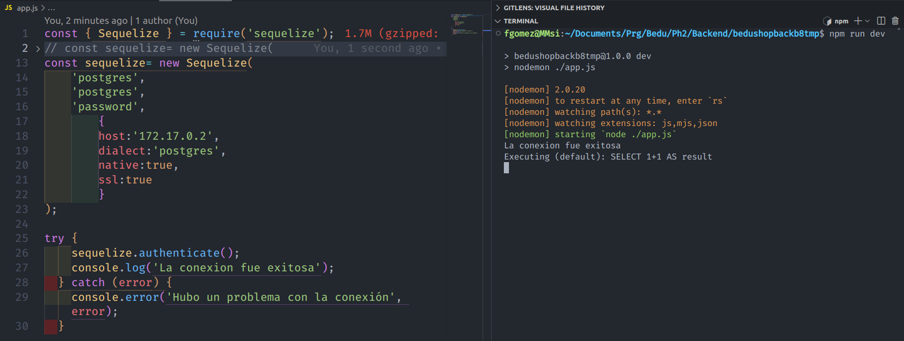
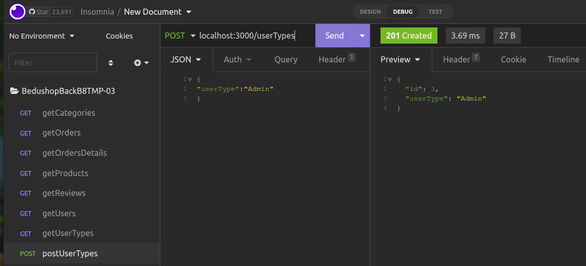
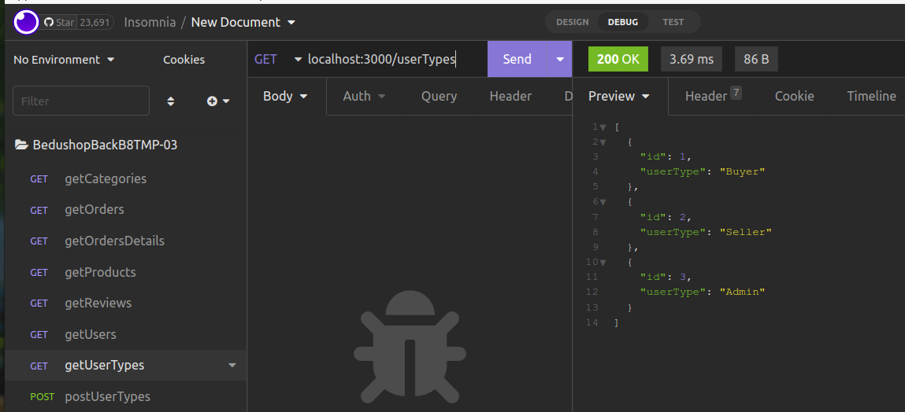

[`Backend Fundamentals`](../../README.md) > [`Sesión 03`](../README.md) > `Postwork`

# Postwork S3

## 🎯 Objetivo

- Conectar la base de datos del proyecto personal con la aplicación.

## ⚙️ Setup
- Node.Js
- npm
- Express
- Body-Parser
- Cors
- Nodemon
- Sequelize
- pg
- pg-hstore
- pg-native

## 📑 Deliverables S3

En este momento ya se debe contar con un modelo del proyecto y una base de datos con la información que se usará en la construcción del mismo a lo largo del módulo. 

A continuación, construye la aplicación y conéctala con la base de datos. 

1. Genera un esqueleto del proyecto similar al que se utilizará para BeduShop. Debe verse así: ✅

```
    Nombre del proyecto/
    ├── config/
    ├── models/
    ├── controllers/
    ├── routes/
    └── app.js
```

2. Instala dentro del proyecto todas las dependencias y paquetes necesarios para que funcione correctamente. Puedes consultar la actividad dos del prework de esta sesión para recordar cómo instalar cada una. La lista completa de dependencias se ve a continuación : ✅
- Express
- Body-Parser
- Cors
- Nodemon
- Sequelize
- pg
- pg-hstore
- pg-native

3. Utilizando las credenciales de Heroku para la base de datos de tu proyecto, define en el archivo app.js la conexión de tu app con la base de datos.  ✅



4. Prueba la conexión con tu base haciendo las consultas que definiste en el postwork de la sesión 2 a través de sequelize.    ✅

Insomnia testing Creating UserType

Insomnia testing Select From -FindAll UserType


## 📑 CHECKLIST S3

Considera que tu proyecto debe cumplir con lo siguiente:
Requisito:  ||  Sí lo cumple    ✅ &check; U+2713 ✅ ✔ ☑ ✓ ||  	No lo cumple  

☐ A. Tener la estructura completa del proyecto hasta el momento,  ✅  junto con la base de datos.   ✅ 

☐ B. Dependencias y paquetes instalados.   ✅		

☐ C. Definir la conexión a la base de datos, usando sequelize.   ✅ 

☐ D. Definir consultas usando los métodos de Sequelize. 		 ✅

COMO ME SALTE DIRECTO DE LOS MODELOS a LOs ControLES nohay busaquedsa con los metodos nativos de Sequelize: destroy, update, etc. Si da tiempo cambiar las imagenes de arriba de muestra por un codigo que haga eso. PEro si no ya en los controles estan las pruebass de que si sirve.

Excepto para busquedas con mas de un filtro a diferentes tablas. Eso tambien se pide en sesion 4 o 5