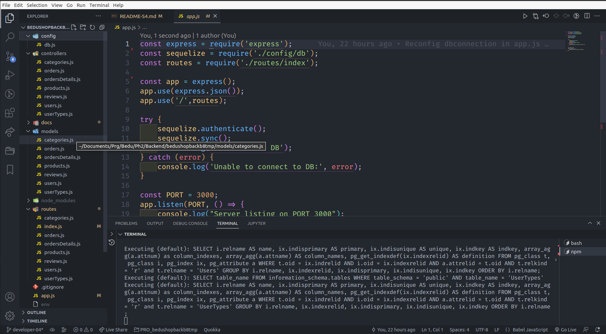
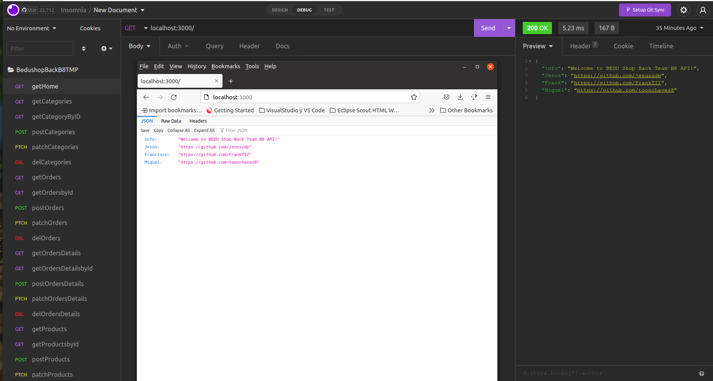
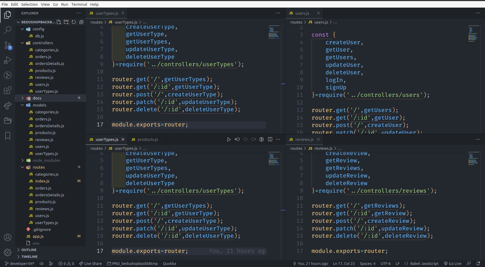
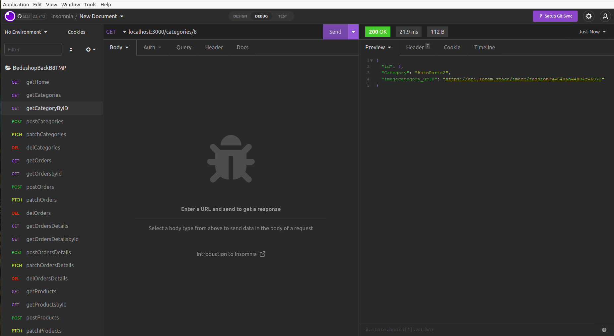
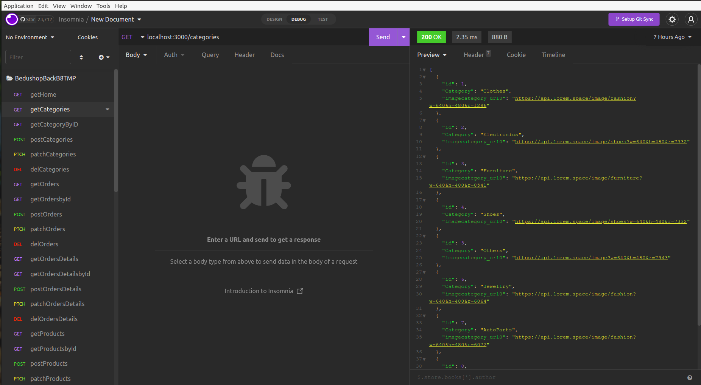
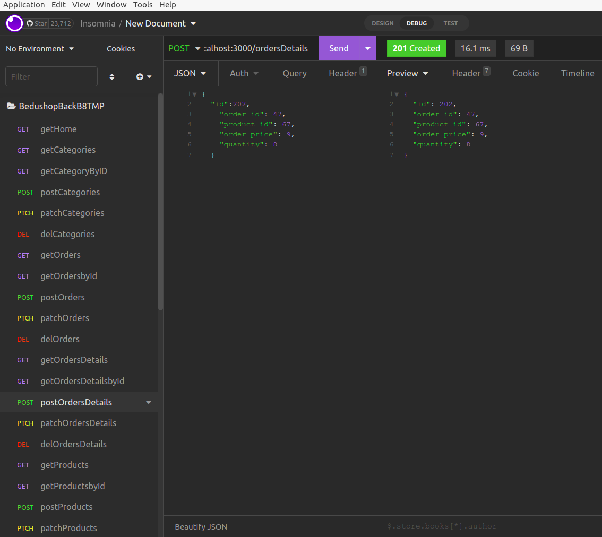

[`Backend Fundamentals`](../../README.md) > [`Sesión 04`](../README.md) > `Postwork`

# Postwork S4

## 🎯 Objetivo

- Definne first API services de la API with Express.js.
- Test API Services with insomnia.

## ⚙️ Setup S4

- Insomnia
- Node.js
- Express.js

## 📑 Deliverables S4

1. Define la configuración de Express en el archivo app.js de tu proyecto BeduShop.   ✅

2. Verifica que funcione correctamente corriendo tu proyecto y haciendo una petición get a la url base desde insomnia.  ✅

 SE HICIERON DE 7 TABLAS o ENTIDADES. EMPEZARON A REVISARSE EN DEVELOPER-03

3. Selecciona una de las tablas de la base de datos de tu proyecto y define el CRUD completo para esa entidad. ✅ 

4. Prueba los servicios que realizaste en el inciso anterior. 
- GETAll  ✅
- GETbyid ✅
- POST    ✅
- PATCHby ✅
- DELETE  ✅

5. Define un nuevo servicio get que sea una búsqueda por id (o el campo de llave primaria de tu tabla). ✅

6. Pruébalo en insomnia. ✅ 

7. Define un servicio que sólo traiga ciertos campos de la tabla, estos campos deben ser seleccionados por el cliente y pasados en la petición.  ✅ 

8. Prueba el servicio del inciso anterior.  ✅ 

9. Haz capturas de pantalla/graba tu pantalla a modo de evidencias y compártelas en el canal de Slack de tu grupo. De igual manera, consérvalas para presentar tu entregable en el Checkpoint.  ✅
- GETCategories

- GETProducts

- POSTOrderDetails

10. Una vez que hayas concluido tu Postwork, responde las siguientes preguntas: 

- ¿Qué pasaría si seguimos definiendo todos los servicios en el archivo app.js?  ✅

 - La administración del codigo y su mantenimiento se vuelve imposible, una labor titánica para los equipos de desarrollo.

- ¿Crees que representa un problema? ¿Por qué?  ✅ 

    Se tendrían problemas para saber donde esta el error al tener Modelos, Controles y Rutas. Matenimiento del codigo muy costoso a largo plazo.

## 📑 CHECKLIST S4

Considera que tu proyecto debe cumplir con lo siguiente:
Requisito:  ||  Sí lo cumple    ✅  ||  	No lo cumple    ❌

☐ A. Configuración de Express. 		  ✅

☐ B. CRUD de una tabla. 	 ✅	

☐ C. Servicios con comportamiento más complejo. 	 ❌