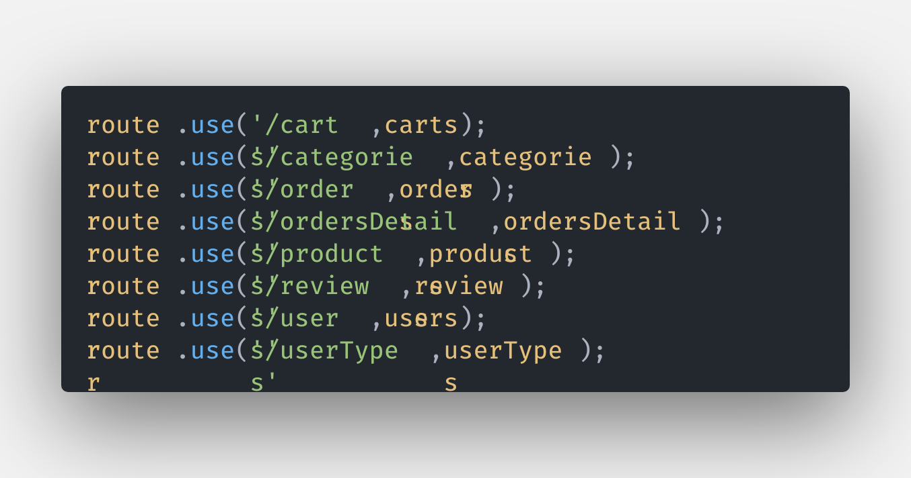
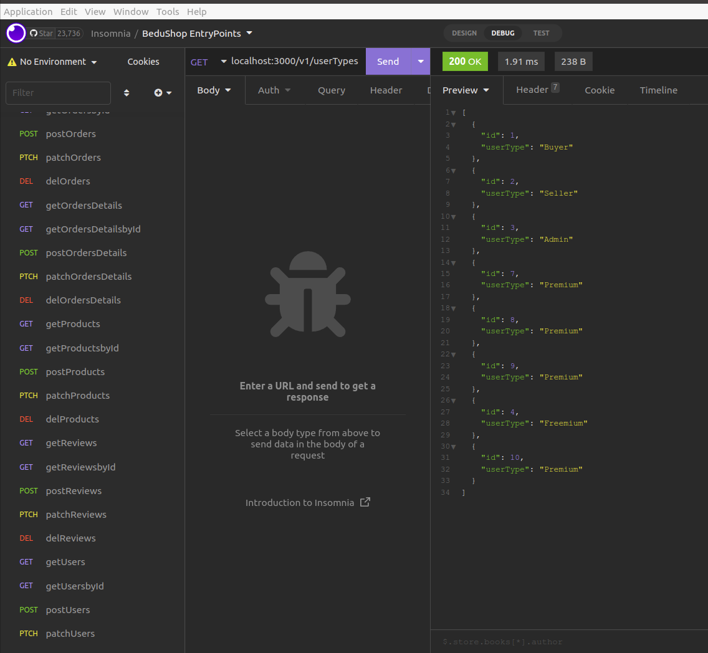

[`Backend Fundamentals`](../../README.md) > [`Sesión 05`](../README.md) > `Postwork`

# Postwork S5

## 🎯 Objetivo

- Modularizar el proyecto que se ha desarrollado hasta ahora.
- Definir rutas para el consumo de los endpoints.

## ⚙️ Setup

- Router

## 📑 Deliverables S5

1. Reestructurar el código del proyecto usando los directorios definidos para controladores y modelos.   ✅ 
(Desde S3)

2. Definir un router para cada una de las entidades del proyecto   ✅

 FALTA AGREGARLE UserTypes: seller, Buyer, Admin, SuperAdmin

3. Crear un archivo routers/index.js y agregar la configuración de los routers definidos.  ✅

4. Agregar la configuración de router al archivo app.js del proyecto para que funcionen los endpoints definidos. Recuerda poner en la url base la versión actual del proyecto v1.  ✅

## 📑 CHECKLIST S5

Considera que tu proyecto debe cumplir con lo siguiente:
Requisito:  ||  Sí lo cumple    ✅  ||  	No lo cumple    ❌

☐ A. Controladores para cada entidad con al menos el CRUD completo 	  ✅	
USERS CRUD de 5 en lugar de LOGIN SIGNIN TEMP incompletas hasta SESION 6 y 7 SEGURIDAD

☐ B. Modelos de cada entidad 		  ✅

☐ C. Routers para cada entidad 		  ✅

☐ D. Configuración general de router.js ✅

☐ E. Un proyecto estructurado en el modelo de directorios  ✅
