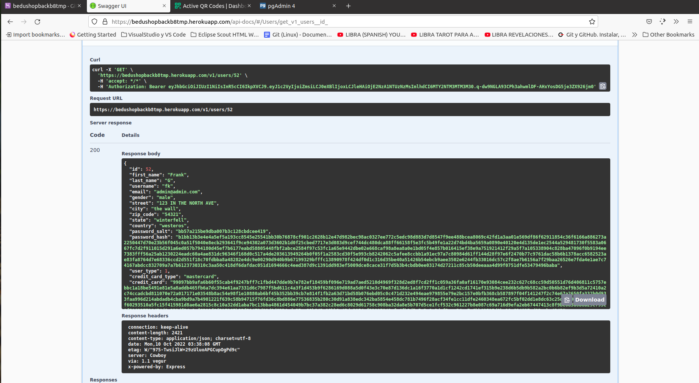

[`Backend Fundamentals`](../../README.md) > [`Sesión 06`](../README.md) > `Postwork`

# Postwork S6

## 🎯 Objetivo

- Aumentar la seguridad en el proceso de almacenamiento de datos.
- Identificar datos sensibles y cifrarlos.

## ⚙️ Setup

- Cypher.js

## 📑 Entregables S6

1. Instala el paquete crypto en tu proyecto personal ✅ y otros mas con

```
npm install crypto jsonwebtoken passport passport-local express-jwt
```


FOTO DEL PACKAGE.JSON

2. De todos los datos presentes en tu base de datos identifica aquellos que sean sensibles o que no deberían ser guardados de forma plana.  ✅ 

        password y tarjetas de credito 

    Y posiblemente el username si no queremos que sea mas dificil si robarán la base de datos. En una nuevo sprint sería tomado por el equipo de desarrollo.

3. Utilizando la investigación realizada en el prework de la sesión elige cuál es el mejor método para proteger estos datos.  ✅  

    - Hasheado con el Salt del password del usuario, de manera que si tenemos que resetear el password se debe solicitar renovar su tarjeta de credito.

    

4. Utiliza la biblioteca crypto para proteger los datos sensibles de la base de datos.  ✅ 

## 📑 CHECKLIST S6

Considera que tu proyecto debe cumplir con lo siguiente:
Requisito: || Sí lo cumple ✅ || No lo cumple ❌

☐ A. Utilizar procesos criptográficos para proteger los datos de la aplicación.  ✅ 