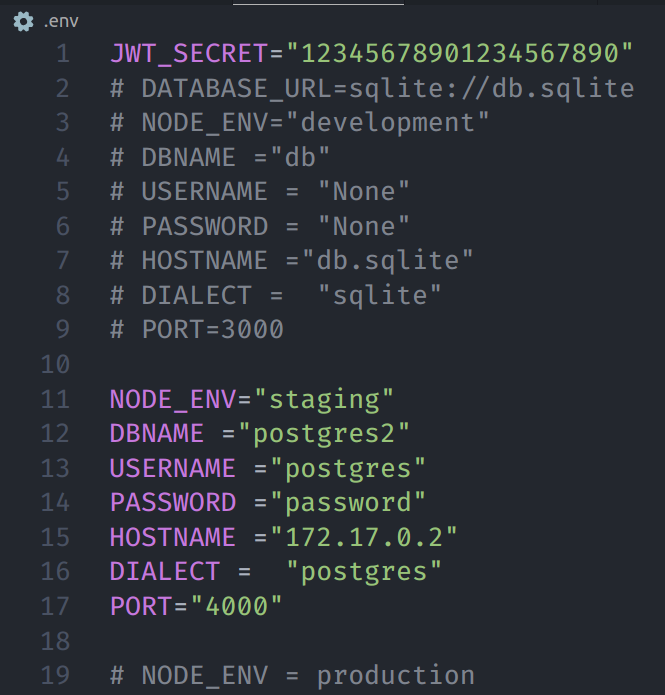
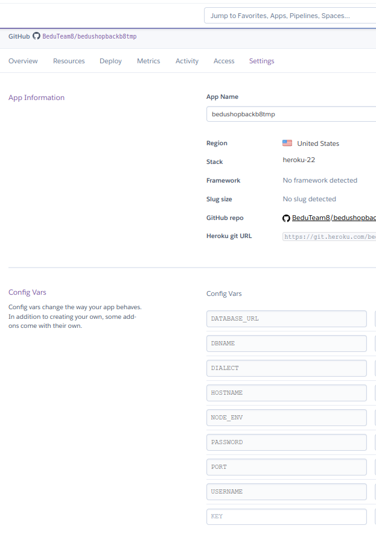
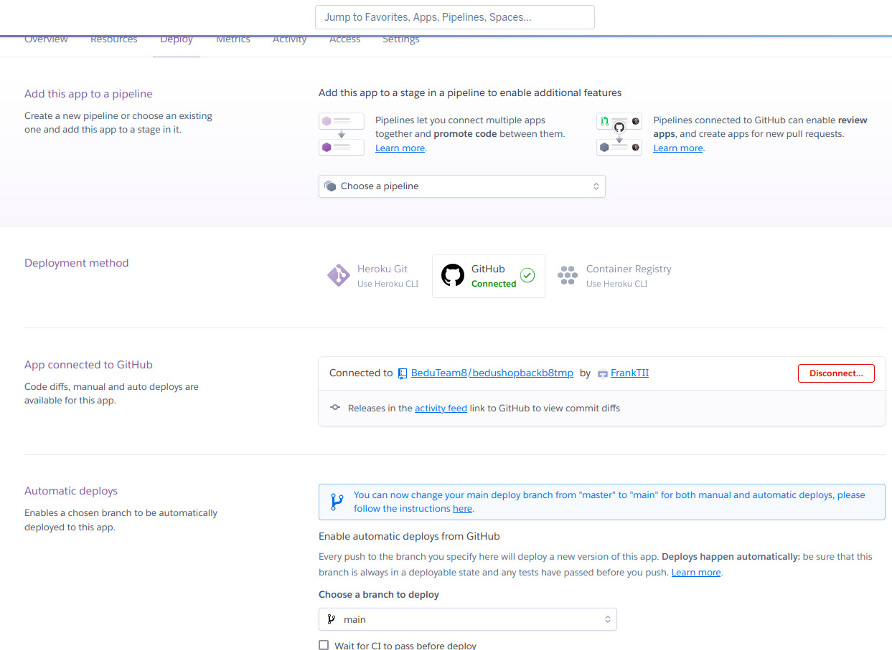

[`Backend Fundamentals`](../../README.md) > [`Sesión 08`](../README.md) > `Postwork`

# Postwork S8

## 🎯 Objetivo

- Definir la documentación de la API mediante swagger.
- Crear y definir variables que funcionen correctamente de manera local.
- Realizar un deploy de la aplicación mediante el repositorio de GitHub.

## ⚙️ Setup

- Heroku
- GitHub

## 📑 Entregables S8

1. Definir las variables de entorno necesarias para ocultar la información confidencial de la aplicación en un archivo (.env).   ✅

2. Crear las variables en la computadora y probar que la aplicación funcione correctamente de forma local  ✅

3. Crear un repositorio de GitHub con el código de la aplicación. Recuerda no subir datos de conección ni el archivo de definición de las variables de entorno (.env)  ✅ 

- https://github.com/BeduTeam8/bedushopbackb8tmp Repositorio de desarrollo, puede que algunos accesos no autorizados se hayan subido por la naturaleza del desarrollo.

4. Usando Heroku, en el mismo proyecto donde tienes la base de datos, deberás hacer deploy de la aplicación por medio del repositorio de GitHub.  ✅ 

5. Probar los servicios de tu aplicación en producción.   ✅ 

6. Crear un Swagger con la documentación de los servicios.  ✅ 

## 📑 CHECKLIST S8

Considera que tu proyecto debe cumplir con lo siguiente:
Requisito:  ||  Sí lo cumple    ✅  ||  	No lo cumple    ❌

☐ A. Ocultar la información de conexión para que no sea pública. 	 ✅ 

☐ B. Crear un repositorio para el proyecto 	✅ 	

☐ C. Hacer deploy de la aplicación con Heroku 	 ✅ 

☐ D. Definir la documentación de la aplicación 		   ✅ 