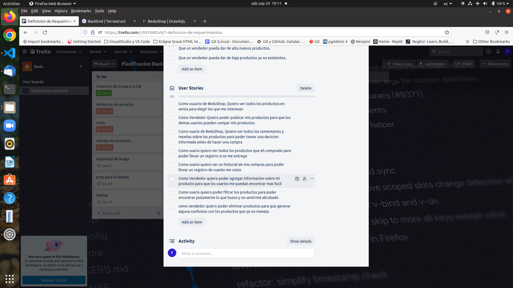

Here you will find all the planning design and scope documentation for this development sesion.

 
- Proj Objs
- Phases & Time Planning
- Architecture & Tools definition, Tooling

[`Backend Fundamentals`](../../README.md) > [`Sesión 01`](../README.md) > `Postwork`

# Postwork

## 🎯 Objetivo

- Explorar y describir las herramientas que se utilizarán en el proyecto. 
- Definir la Arquitectura y requerimientos del proyecto personal.

## ⚙️ Setup
 - Trello

### 🫀 Trello

Para que todo el mundo tenga claro lo que hay que hacer, haz clic en las tarjetas y añade más información, como, por ejemplo:
- Descripciones
- Fechas de vencimiento
- Miembros
- Checklists
- Adjuntos
- Comentarios
 
## 🫀 Entregables

1. Los objetivos generales del proyecto están pensados desde un punto de vista de un cliente que le solicita a un equipo de desarrollo la implementación del proyecto, es decir, objetivos no técnicos.
2. Definir en un tablero en Trello la planificación temporal del proyecto, basándose en la vista en el work. Pues el proceso de desarrollo será muy similar. Agregar un screenshot del tablero al documento. Utilizar también todo el conocimiento nuevo de trello de la sección anterior si es posible. Hay que considerar que la fecha de presentación del proyecto final será en la sesión de Checkpoint 
- 

- https://trello.com/b/SyEmy5H6/planificacion-backend

3. Diagrama de herramientas a utilizar. Mencionar qué son y para qué sirven:
- PstgreSQL
- JavaScript
- Node.js
- npm
- Sequelize
- Express.js
- Github
- Heroku

4. 6 historias de usuario que definan las funcionalidades de estos dentro de la aplicación. Y explicar por qué son importantes estas funcionalidades.

5. Identificación de los modelos del proyecto, cada uno con sus características específicas, dentro de una arquitectura modelo vista controlador. 
