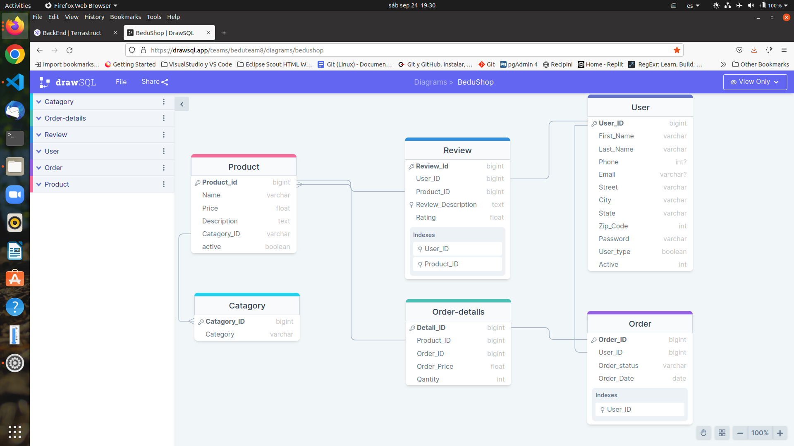
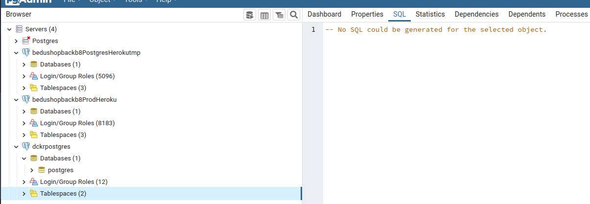
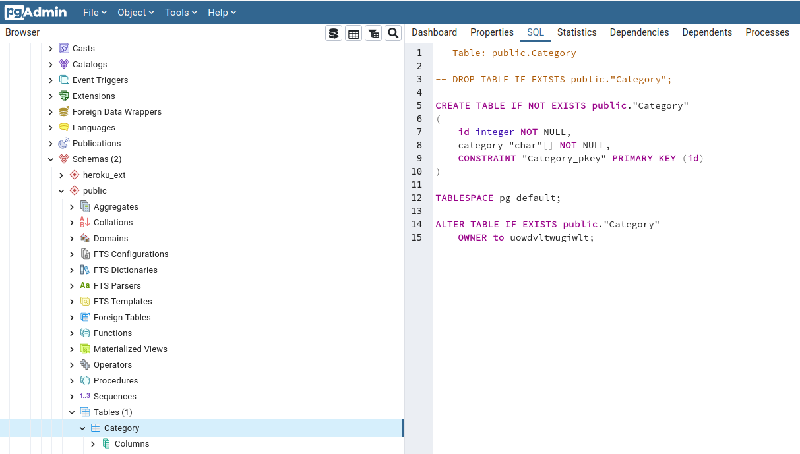

Here you will find all the planning design and scope documentation for this development sesion.

 
- Proj Objs
- Phases & Time Planning
- Architecture & Tools definition, Tooling

[`Backend Fundamentals`](../../README.md) > [`Sesión 02`](../README.md) > `Postwork`

# Postwork S2

## 🎯 Objetivo

- Crear una base de datos con tablas y registros.

## ⚙️ Setup
 - PosgreSQL

## S2 Deliverables

Create and config a data basefor the project. **BeduShop**. 

1. 

2. Pruebas de Conexión

- 

- 

3. 

4. 

5.  

📑 CHECKLIST

Considera que tu proyecto debe cumplir con lo siguiente:
Requisito:  ||  Sí lo cumple    ✅  ||  	No lo cumple    ❌
☐ A. Tener una base de datos 		  ✅ 
☐ B. La base de datos debe tener al menos 3 tablas. 	 ❌	
☐ C. Cada tabla debe tener al menos 50 registros (en caso de ser posible). 	 ❌

