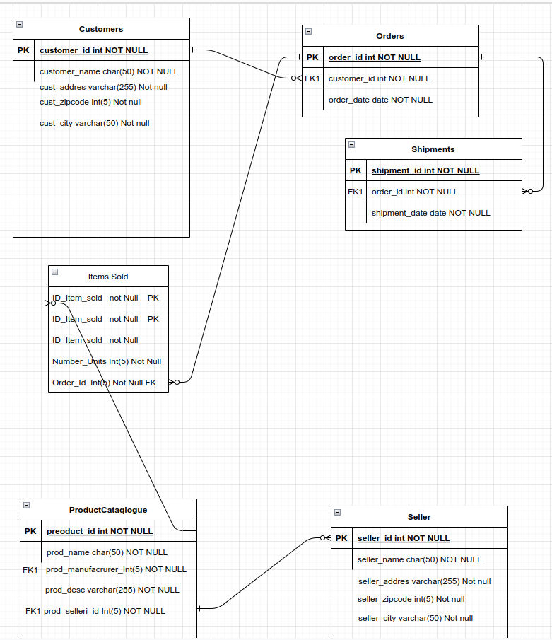
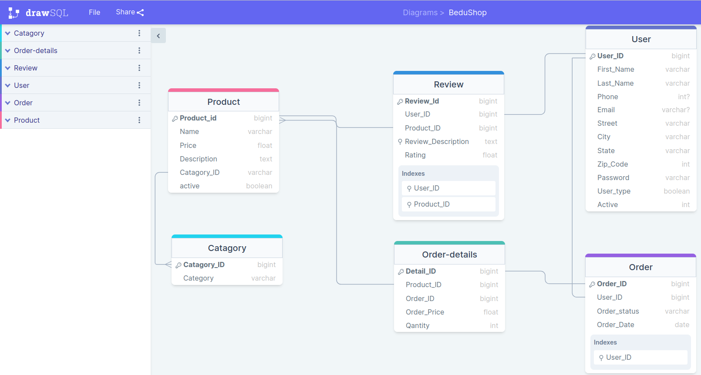
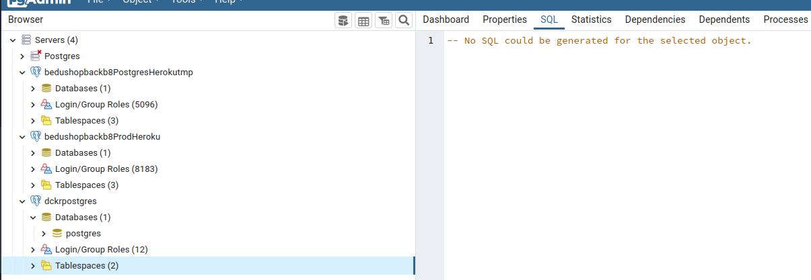
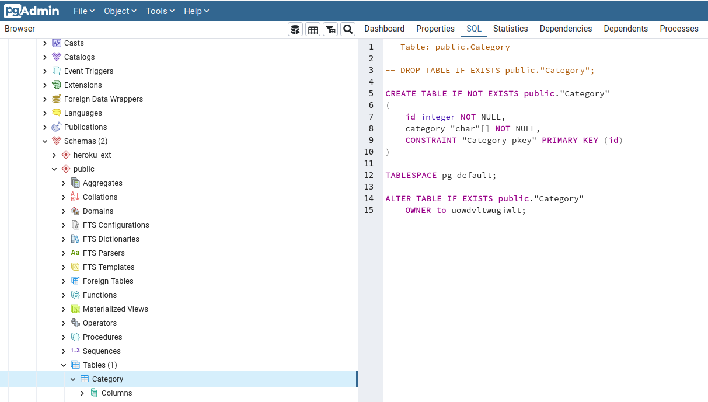
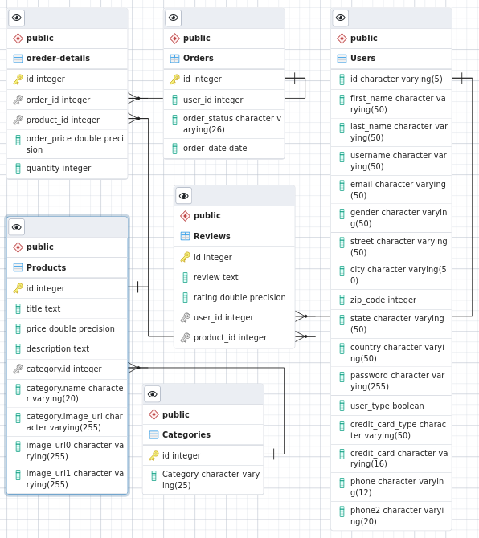
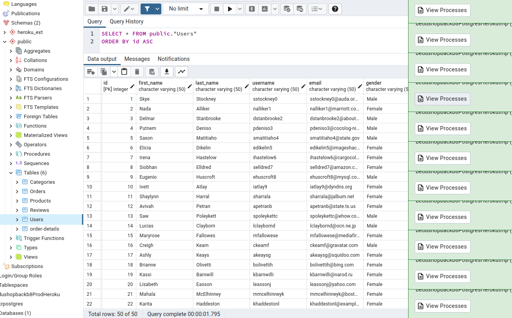
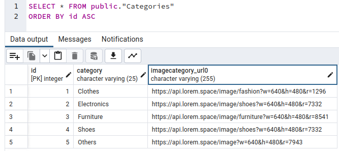
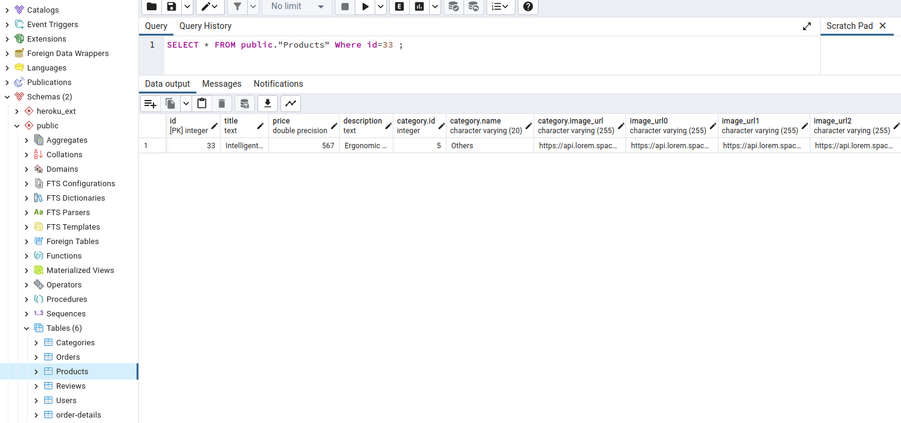
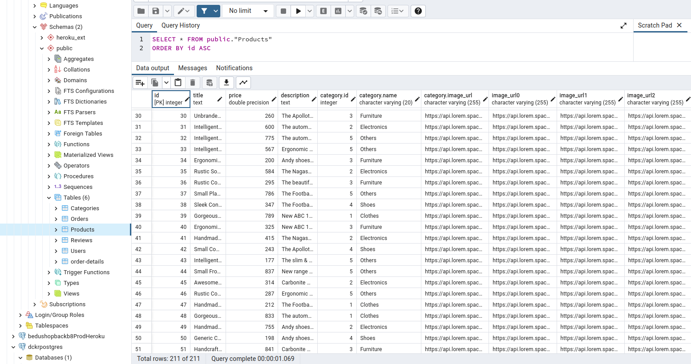

Here you will find all the planning design and scope documentation for this development sesion.

 
- Proj Objs
- Phases & Time Planning
- Architecture & Tools definition, Tooling

[`Backend Fundamentals`](../../README.md) > [`Sesión 02`](../README.md) > `Postwork`

# Postwork S2

## 🎯 Objetivo

- Crear una base de datos con tablas y registros.

## ⚙️ Setup
 - PosgreSQL

## 📑 Deliverables S2

Create and config a database for the project. **BeduShop**. 

1.  ERD for the project (first aproach)    ✅
 

 ERD for the project (second aproach)    ✅

2. Conectivity to DB in local docker  ✅ and Heroku dB ✅

- 

- 

3. db Schema used and tested via PGAdmin   ✅
   

4. Datasets to populate dB. 
Generated, related and loaded to folder.    ✅  DB upload    ✅
- 
- 
- 
- 
- 
- 

5. First Queries to the dB.   ✅ 

SQLScript to create db Table 

## 📑 CHECKLIST S2

Considera que tu proyecto debe cumplir con lo siguiente:
Requisito:  ||  Sí lo cumple    ✅  ||  	No lo cumple    ❌

☐ A. La aplicación debe de tener usuarios, de preferencia que se incluyan diferentes tipos de usuario con privilegios distintos   ✅

☐ B. Se debe considerar que adicionalmente a los usuarios serán necesarias al menos dos entidades (modelos dentro de MVC) más.    ✅	

☐ C. Cada una de las entidades (incluyendo a los usuarios) debe tener características o atributos bien definidos. ✅
